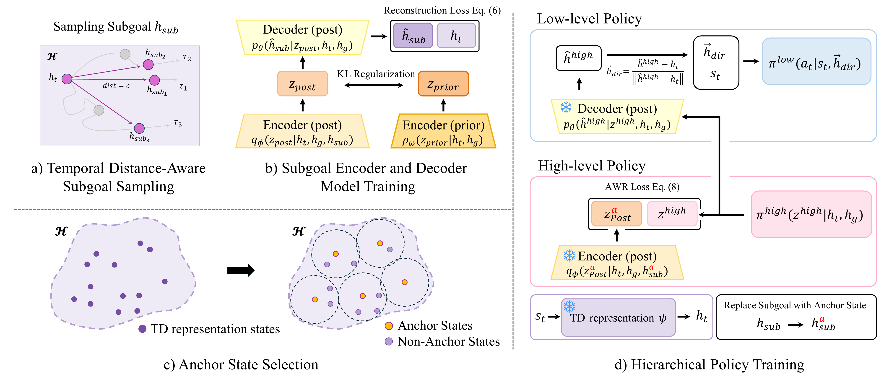
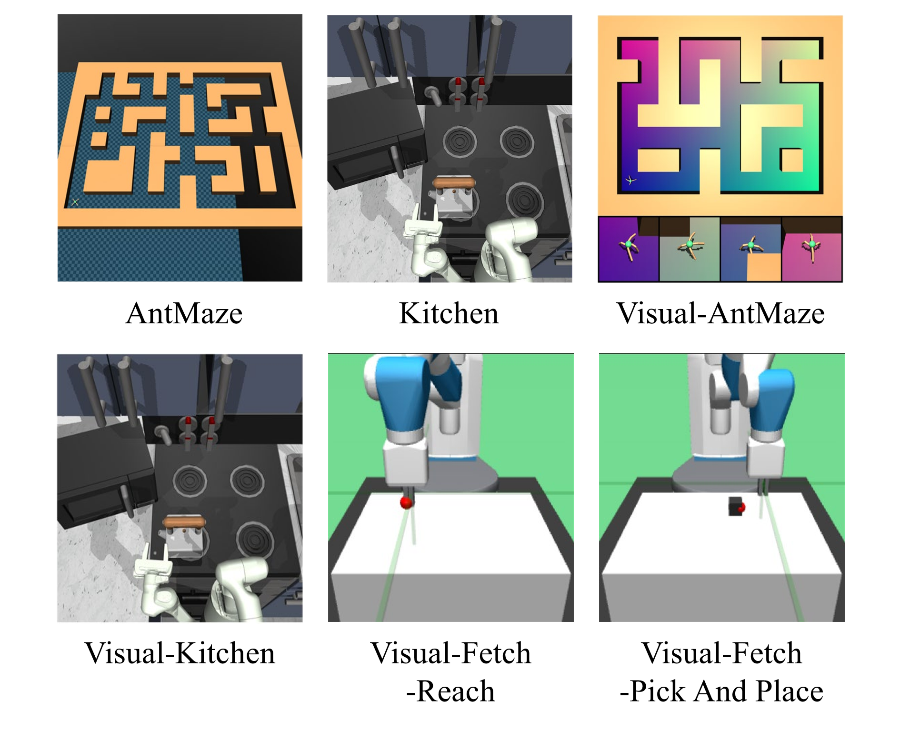
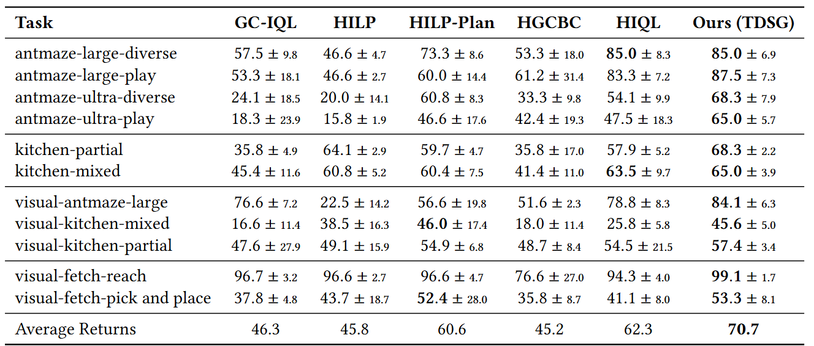

# TDSG: Temporal Distance-aware Subgoal Generation for Offline Hierarchical Reinforcement Learning

<!-- <p align="left">
  <a href="https://www.arxiv.org/abs/2506.07744"></a>
  <a href="https://qortmdgh4141.github.io/projects/GAS/"></a>
  <a href="https://www.youtube.com/watch?v=6mxRlbn2_6s"></a>
</p> -->


:bell: We are happy to announce that TDSG was accepted at **CIKM 2025**. :bell:

This is the official implementation of Temporal Distance-aware Subgoal Generation.

<!-- This is the official implementation of **[Temporal Distance-aware Subgoal Generation](https://arxiv.org/abs/2506.07744)** (**TDSG**) -->




<p align="center">
  
  
</p>


<!-- See the [project page](https://qortmdgh4141.github.io/projects/GAS/) for more details. -->


## Installation

```
conda create --name ask python=3.8
conda activate tdsg
pip install -r requirements.txt --no-deps
pip install "jax[cuda11_cudnn82]==0.4.3" -f https://storage.googleapis.com/jax-releases/jax_cuda_releases.html
```
## Script

```
# antmaze-ultra-diverse
python main.py --save_dir "experiment_output" --run_group "ant-ultra-diverse"  --seed 0 --env_name "antmaze-ultra-diverse-v0" --pretrain_steps 500002 --eval_interval 100000 --save_interval 100000 --subgoal_dim 10 --td_dim 32 temporal_dist 15 --anchor_interval 20 --hilp_pretrain_expectile 0.9 --pretrain_expectile 0.7 --low_pretrain_expectile 0.9 --high_temperature 5 --temperature 10

# antmaze-large-diverse
python main.py --save_dir "experiment_output" --run_group "ant-large-diverse" --seed 0 --env_name "antmaze-large-diverse-v2" --pretrain_steps 500002 --eval_interval 100000 --save_interval 100000 --subgoal_dim 10 --td_dim 32 temporal_dist 15 --anchor_interval 20 --hilp_pretrain_expectile 0.9 --pretrain_expectile 0.7 --low_pretrain_expectile 0.9 --high_temperature 5 --temperature 10

# kitchen-mixed
python main.py --save_dir "experiment_output" --run_group "kitchen-mixed" --seed 0 --env_name "kitchen-mixed-v0" --pretrain_steps 250002 --eval_interval 50000 --save_interval 50000 --subgoal_dim 10 --td_dim 32 temporal_dist 40 --anchor_interval 20 --hilp_pretrain_expectile 0.95 --pretrain_expectile 0.7 --low_pretrain_expectile 0.7 --high_temperature 5 --temperature 10

# visual-antmaze-large
python main.py --save_dir "experiment_output" --run_group "visual-ant-large" --seed 0 --env_name "visual-antmaze-large-diverse-v2" --pretrain_steps 500002 --eval_interval 100000 --save_interval 100000 --subgoal_dim 10 --td_dim 32 temporal_dist 15 --anchor_interval 20 --hilp_pretrain_expectile 0.9 --pretrain_expectile 0.7 --low_pretrain_expectile 0.9 --high_temperature 5 --temperature 10

# visual-kitchen-mixed
python main.py --save_dir "experiment_output" --run_group "visual-kitchen-mixed" --seed 0 --env_name "visual-kitchen-mixed-v0" --pretrain_steps 250002 --eval_interval 50000 --save_interval 50000 --subgoal_dim 10 --td_dim 32 temporal_dist 40 --anchor_interval 20 --hilp_pretrain_expectile 0.9 --pretrain_expectile 0.7 --low_pretrain_expectile 0.7 --high_temperature 0.3 --temperature 15

# visual-fetch-reach
python main.py --save_dir "experiment_output" --run_group "FetchReach-v1" --seed 0 --env_name "visual-fetch-reach" --pretrain_steps 500002 --eval_interval 100000 --save_interval 100000 --subgoal_dim 10 --td_dim 32 temporal_dist 5 --anchor_interval 4 --hilp_pretrain_expectile 0.95 --pretrain_expectile 0.7 --low_pretrain_expectile 0.7 --high_temperature 1 --temperature 10


## Citation
